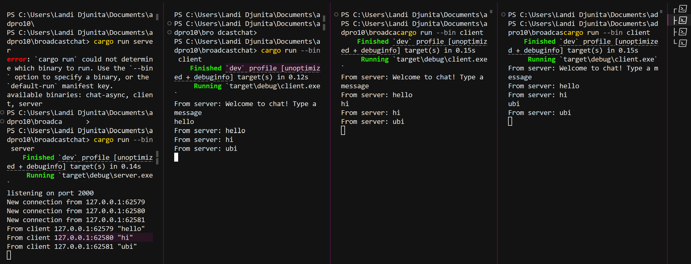
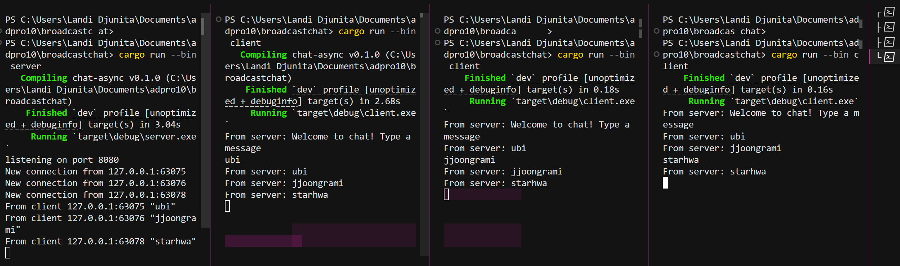
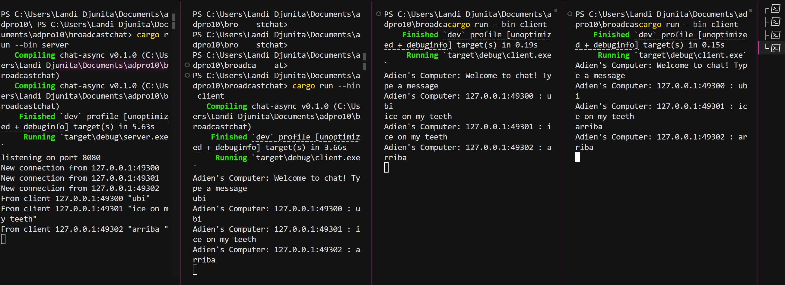

## Original broadcast chat code

This is run with cargo run--bin server first and then three terminals for cargo run --bin client. Each client terminal displays “Welcome to chat! Type a message." When something is typed and soon entered into the client terminal, that client sends the text to the server. The server will then log it (e.g. From client 127.0.0.1:62579 "hello", from the screenshot attached). The server will then rebroadcasts “hello” to everyone on its Tokio broadcast channel, and to all three clients instantly.

## Modifying the websocket port

In the server.rs, replace `let listener = TcpListener::bind("127.0.0.1:2000").await?;` with `let listener = TcpListener::bind("127.0.0.1:8080").await?;`. whereas in client.rs, replace `ClientBuilder::from_uri(Uri::from_static("ws://127.0.0.1:2000"))` with `ClientBuilder::from_uri(Uri::from_static("ws://127.0.0.1:8080"))`. Other than these lines of codes, everything remains the same. When the server and client are run, the server will listen on port 8080.

# Small Changes 

The broadcast is changed on the server so that instead of just rebroadcasting the raw text, it prefixes each broadcast with the sender’s socket address. Whereas on the client's side, the println! is updated to use a consistent “Adien’s Computer: {}” prefix when displaying incoming text. By doing so, the  server now embeds each sender’s IP and port into every outgoing message, and the client prints the enriched string with a consistent label.